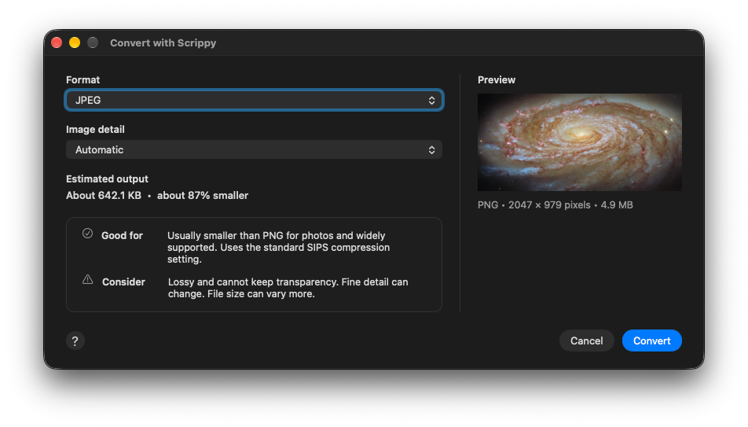
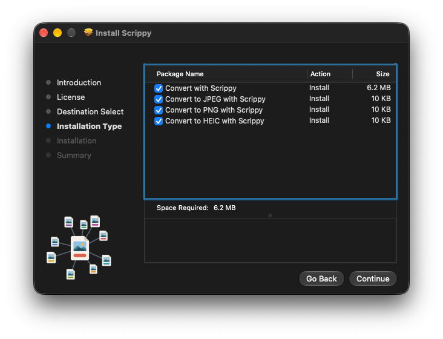
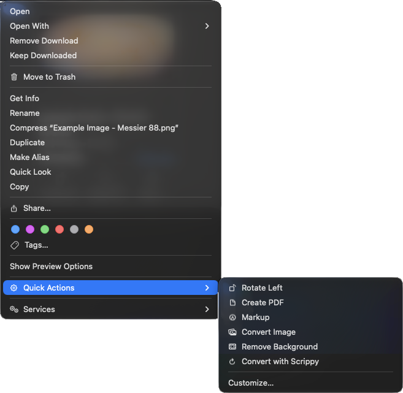

# Scrippy

[](LICENSE)
[](#requirements)

[](https://github.com/drabhikroy/scrippy/releases/latest)


Scrippy converts images to any format your Mac can write, straight from
Finder. Select one image, a handful, or a folder, right-click, and pick a
format. The name comes from SIPS, the Scriptable Image Processing System built
into macOS, which does the conversion.

Everything runs on your Mac. No account is required, no server is used, and
your images never leave your computer.

## What it does

Select images or a folder in Finder, right-click, and choose **Quick Actions**,
then **Convert with Scrippy**. A small window asks for the format, and the
converted copies are saved beside the originals. For the formats people reach
for most, **Convert to JPEG with Scrippy**, **Convert to PNG with Scrippy**,
and **Convert to HEIC with Scrippy** skip the window and convert in one step.



- **Every format your Mac can write.** The menu is read from SIPS on your own
  Mac each time. The six formats most people want come first, and new formats
  from a macOS update appear on their own.
- **A plain explanation of each choice.** The window says what the selected
  format is good for and what to keep in mind, such as whether it keeps
  transparency or how widely it is supported.
- **An image detail setting for lossy formats.** JPEG, HEIC, AVIF, and JPEG
  2000 offer six settings, from Automatic through Smaller file to Highest
  detail. Scrippy remembers
  the last format and setting you used.
- **A size estimate before you convert.** The window converts one image to a
  temporary file for the option on screen and tells you roughly how large the
  result will be.
- **Batches you can stop.** Several images, or every image directly inside a
  folder, convert in one pass. A long batch shows its progress and can be
  stopped between images.
- **A small app for everything else.** Opened from the Applications folder,
  Scrippy shows whether its Finder actions are in place, points you to an
  example image to practice on, and holds the help, the version and license
  details.
- **A clean way out.** A separate uninstaller package removes everything the
  installer added, and the Scrippy menu offers the same.

## What it does not do

It never changes, moves, or replaces an original. When a name is taken, the
copy gets `-1`, `-2`, and so on, so an earlier converted copy is never
overwritten either.

It does not look inside subfolders. A selected folder is read one level deep,
so a conversion never reaches further than the files you can see.

It does not resize, crop, rotate, or edit images, and it does not create
animated GIFs. It does not install an image library of its own. Every
conversion is done by SIPS.

## Requirements

macOS 11 or later, on Apple silicon or Intel. Nothing else is needed. SIPS is
part of macOS, and the installer does not ask for an administrator password.

## Install

Download `Scrippy-1.0.0.pkg` from the [latest
release](https://github.com/drabhikroy/scrippy/releases/latest) and open it.
Everything is installed into your own account.

The Installation Type page lists the Quick Actions. **Convert with Scrippy**
is always installed. The three one-step actions are optional, and all of them
are selected unless you clear them.



Afterward, open **Scrippy** from the Applications folder in your home folder.
It shows which Finder actions are installed and where to start.

To remove Scrippy, open `Uninstall-Scrippy-1.0.0.pkg` from the same release,
or choose **Uninstall Scrippy** from the Scrippy menu. Your images and the
copies Scrippy made are not touched.

`SHA256SUMS.txt` is published beside the packages. To check a download, put
it and `SHA256SUMS.txt` in one folder and run:

```bash
shasum -a 256 -c SHA256SUMS.txt
```

## Using Scrippy

1. In Finder, select one image, several images, or a folder.
2. Right-click the selection and choose **Quick Actions**, then **Convert with
   Scrippy**.
3. Pick a format, and an image detail setting if one is offered, then click
   **Convert**.



A notification confirms the result. If any file could not be converted, an
alert says how many and offers **Show Log**, which shows the log in Finder.
The log gives the reason for each one.

If the actions are missing from the Quick Actions menu, open Scrippy and click
**Choose Which Actions Appear**.

Help is built into the app. Choose **Scrippy Help** from the Help menu, or
click the help button in the conversion window. The same text is installed as
a page that opens in a browser, through **Open Help in Browser**.

## Your data

Conversion and size estimates both run locally through SIPS. Scrippy makes no
network connections. Links in the Help menu, the help, and the About panel
open in your browser only when you choose them.

Scrippy writes only these files:

- Converted copies beside your originals. Each copy is written into a hidden
  staging folder beside the original first and moved into place in one step,
  then the staging folder is removed.
- Temporary estimate files in a private folder. Each is deleted as soon as it
  has been measured, and the folder is removed when the conversion ends.
- A log at `~/Library/Logs/Scrippy/scrippy.log` that records failed
  conversions and trims itself back once it passes one megabyte.
- Your last format and detail setting, in Scrippy's preferences.

## Accessibility

- Every window is built from standard macOS controls, so VoiceOver, Full
  Keyboard Access, Increase Contrast, and Reduce Transparency work as they do
  elsewhere
- Status on the landing screen is shown by symbol shape as well as color, a
  check for installed and a cross for missing
- Menus, buttons, and the help topic list carry accessibility labels, and
  decorative symbols are hidden from VoiceOver. The progress window announces
  each change in its status
- Return converts and Escape cancels or stops. Every menu command has its
  usual shortcut, including Command W to close, Command F to search help,
  Command P to print a help topic, and Command Question Mark for help
- Notes, estimates, and help text are selectable, so any of it can be copied
- The installer pages and the help page follow light and dark appearance and
  meet WCAG 2.2 AA contrast. The help page has a skip link, a visible focus
  ring, and honors Reduce Motion

## How it works

Each Quick Action is an Automator workflow that passes the Finder selection to
a shell script. The script asks SIPS which files it can read and which formats
it can write, then starts Scrippy.app to ask which format to use. The app
answers with one line, the format and detail setting, and the script runs SIPS
once for each image. The one-step actions pass their format to the script
directly and never open the window.

The app never converts anything itself except the single temporary file
behind each estimate. Its answer is checked against the list of formats the
script built, so only a format SIPS reported as writable can be used. The
script looks for the app in two fixed places only, the Applications folder in
your home folder and the main Applications folder.

## Help

The help source is [help/Scrippy Help.md](help/Scrippy%20Help.md). The app
reads it directly, and `Scripts/make_help.py` turns it into the browser page
[help/Scrippy Help.html](help/Scrippy%20Help.html).

## For developers

### Project layout

| Path | Holds |
| --- | --- |
| `src/scrippy.sh` | The conversion engine the Finder actions run |
| `package/app/Sources/` | Scrippy.app: the landing screen, conversion window, progress window, help window, menus, and the uninstall command |
| `package/app/Info.plist` | The app bundle's name, version, and copyright |
| `workflow/` | The main Quick Action. The build makes the one-step actions from it |
| `package/` | Installer layout, pages, backgrounds, and the postinstall script |
| `package/uninstall/` | The uninstaller package: its pages and the script that removes Scrippy |
| `help/` | The help source and the page generated from it |
| `Assets/` | Icon sources and rendered PNGs, see [Assets/README.md](Assets/README.md) |
| `Scripts/` | Generators for the icon, the help page, and the license pane, plus the screenshot cleaner and the house writing gate |
| `tests/` | Engine and project tests, with stand-ins for SIPS, osascript, and the app |

### Dependencies

Building needs Xcode or the Command Line Tools for `swiftc`, `lipo`, `python3`,
and the packaging tools. Tests need Python 3 and Bash. Rebuilding the icons
needs the `cairosvg` and `Pillow` Python packages.

### Running from source

```bash
git clone https://github.com/drabhikroy/scrippy.git
cd scrippy
```

Compile the app into the place the engine looks for it, then run the engine
against your real SIPS:

```bash
mkdir -p ~/Applications/Scrippy.app/Contents/MacOS ~/Applications/Scrippy.app/Contents/Resources
cp "help/Scrippy Help.md" ~/Applications/Scrippy.app/Contents/Resources/
xcrun swiftc -framework AppKit -framework QuickLookThumbnailing package/app/Sources/*.swift -o ~/Applications/Scrippy.app/Contents/MacOS/Scrippy
bash src/scrippy.sh Example/*.png
```

To try a one-step action instead:

```bash
bash src/scrippy.sh --to png Example/*.png
```

### Tests and standards gates

```bash
python3 -m unittest discover -s tests
python3 Scripts/standards_gate.py
```

The engine tests run the real script with stand-ins for SIPS, osascript, and
the Scrippy app, so they pass on Linux as well as macOS. A security group in
them covers symbolic links at the destination, names with line breaks, names
that look like options, and staging cleanup. The project tests check that the
help page matches its source. The gate enforces the house writing rules
described in [CONTRIBUTING.md](CONTRIBUTING.md).

### Building distributable packages

Double-click **Make Public Installer.command**. It builds Scrippy.app as a
universal binary and makes the one-step actions from the main workflow. It
then builds two packages, signs and notarizes each, staples the tickets,
checks them with Gatekeeper, and leaves them in `Release/` with
`SHA256SUMS.txt`:

- `Scrippy-VERSION.pkg` installs Scrippy. The app and the main action go in
  one component, and each one-step action goes in its own, so people can
  choose them on the Installation Type page.
- `Uninstall-Scrippy-VERSION.pkg` carries no files. Its one script removes
  what the installer placed.

The version comes from the `VERSION` file alone.

To check the installer pages without signing or notarizing, run it from
Terminal with `--preview`. That leaves unsigned copies of both packages in
`dist/` and opens the installer.

### Code signing and verification

The build uses the first Developer ID Application and Developer ID Installer
certificates in your keychain, and the notary profile named **Scrippy**.
Create the profile once with:

```bash
xcrun notarytool store-credentials "Scrippy"
```

To check a finished package:

```bash
pkgutil --check-signature Release/Scrippy-1.0.0.pkg
spctl --assess --type install --verbose=2 Release/Scrippy-1.0.0.pkg
spctl --assess --type install --verbose=2 Release/Uninstall-Scrippy-1.0.0.pkg
```

## Contributing

Conventions, tests, and house writing rules are in
[CONTRIBUTING.md](CONTRIBUTING.md). Security reports go to the address in
[SECURITY.md](SECURITY.md).

## Releases

What changed in each release is in [CHANGELOG.md](CHANGELOG.md). The
installer and uninstaller packages are on the
[Releases](https://github.com/drabhikroy/scrippy/releases) page, with a
`SHA256SUMS.txt` beside them.

## Credits and background

The example image of Messier 88 is credited to ESA/Hubble and NASA, D. Thilker
and the MAUVE-HST Team, and is used under [CC BY
4.0](https://creativecommons.org/licenses/by/4.0/). The source is the
[ESA/Hubble picture of the month](https://esahubble.org/images/potm2605a/).

## License

[PolyForm Noncommercial License 1.0.0](LICENSE). The full text is also at
<https://polyformproject.org/licenses/noncommercial/1.0.0>.

Personal use, personal study, hobby projects, teaching, academic research, and
use by charitable, educational, nonprofit, public research, public health, and
government organizations are permitted. Commercial use is not permitted without
a separate license.

Required notice: Copyright 2026 Abhik Roy.

The example image keeps its own CC BY 4.0 license, described under Credits and
background.
